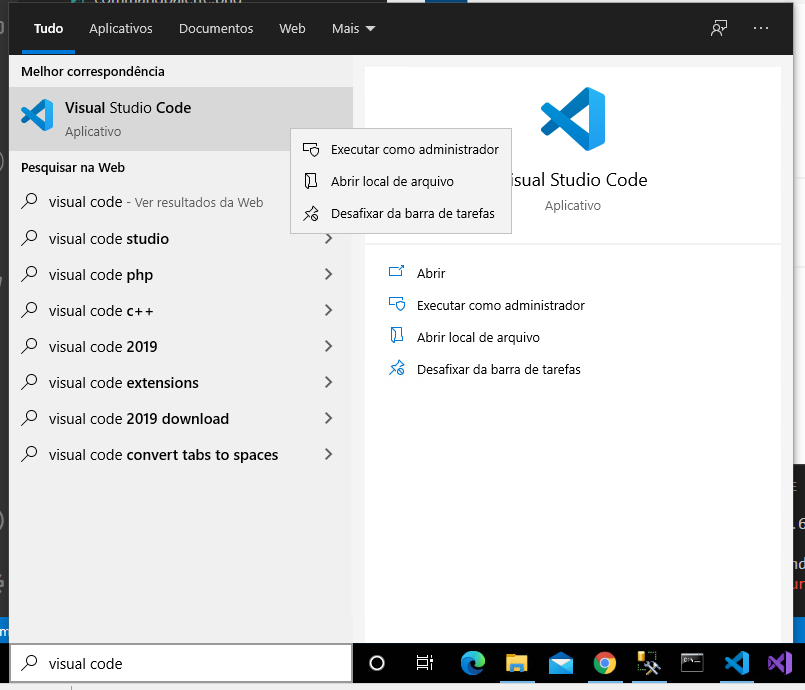
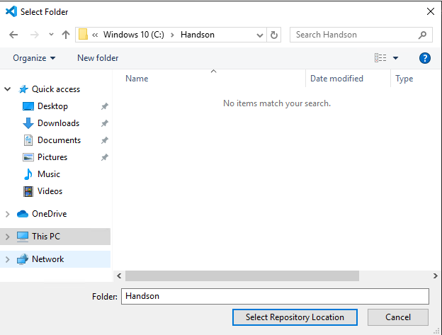
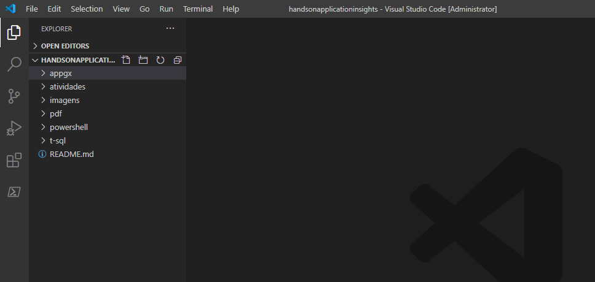

# Atividade 01

Download da máquina virtual e configuração do IIS, instalação do SQL Server e instalação da aplicação.

## Configuração da VM

Para este hands-on utilizaremos uma VM para instalar a aplicação e o agente de monitoramento.

### Download da VM

No link abaixo estão disponíveis VMs em HyperV, VirtualBox e VMware.

<https://developer.microsoft.com/pt-br/microsoft-edge/tools/vms/>

Selecione a opção com o Windows 10, a plataforma de VM escolha o tipo que tiver mais familiaridade.

Se você não tem nenhum gerenciador de VM instalado na sua máquina, utilize o VirtualBox:

VirtualBox - Instalação do VirtualBox
<https://www.youtube.com/watch?v=8mns5yqMfZk>

VirtualBox - Como importar um vdi.
<https://www.youtube.com/watch?v=fVYwt1Tluug>

Após o download da VM e da sua configuração, inicie ela e logue no Windows.

### Chocolatey

Para facilitar a configuração da VM vamos utilizar o gerenciador de pacotes Chocolatey.

Para instalar o Chocolatey, será necessário executar powershell como administrador. No box de pesquisa do Windows, digitar powershell, e clicar com o botão direito do mouse no ícone do Powershell e clicar na opção Executar como administrador.

Acessar o link abaixo para ver as instruções de instalação do Chocolatey:

<https://chocolatey.org/install>

### Instalação dos softwares

Após a instalação do Chocolatey, vamos utilizá-lo para instalar os outros softwares que utilizaremos neste hands-on. Para isso abra o Powershell como administrador.

#### Git

Para instalar o Git utilizando o Chocolatey, digite o comando abaixo no prompt do Powershell:

        choco install git

Responder a pergunta "Do you want to run the script?" com "A".

#### Visual Code

Para instalar o Visual Code utilizando o Chocolatey, digite o comando abaixo no prompt do Powershell:

        choco install vscode

Responder a pergunta "Do you want to run the script?" com "A".

#### Clonar o repositório do hands-on

Abrir o Visual Code como administrador.

Criar uma pasta com o nome de "Handson" no drive C.

Para clonar o projeto do Github nesta pasta, clicar na opção View ->  Command Palete.

Na box de comandos, selecionar a opção Git:Clone.

Informar a url <https://github.com/mshimao/handsonapplicationinsights.git> na url do comando git clone.

Selecionar a pasta C:\handson como destino.

Após a execução do clone, abrir o repositório, clicando em Open.

O Visual Code abrirá posicionado na pasta C:\Handson\handsonapplicationinsights.

### Configuração do IIS

Para configurar o IIS vamos executar um script powershell, para isso vamos usar o terminal do Visual Code, para abrir um terminal, clique na opção Terminal -> New Terminal.

Na janela do teminal, ir para a pasta powershell:

        cd powershell

Executar o script installiis.ps1

        .\installiis.ps1

Se ocorrer o erro abaixo, feche o Visual Code, e reabra ele executando como administrador e reexecute o script.

Responder "N" para as perguntas "Do you want to restart the computer to complete this operation now?".

Após a instalação, reiniciar o Windows da VM, para que Windows complete a configuração do IIS.

Após o restart do Windows, abrir novamente a VM.

### Urlrewrite

Abrir o Visual Code como administrador na pasta C:\Handson\handsonapplicationinsights e abrir um terminal, e executar o comando abaixo:

        choco install urlrewrite -y

### Chrome

Para instalar o Chrome, executar o comando no terminal powershell do Visual Code.

        choco install googlechrome

Reponder a pergunta "Do you want to run the script?([Y]es/[A]ll" com "A".

### SQL Express 2014

Para instalar o SQL Express 2014, executar o comando abaixo no terminal powershell do Visual Code. O comando abaixo instala o SQL Express 2014 e configura o usuário "sa" com a senha "sa!2014". Este pacote já inclui o SQL Server Management Studio.

        choco install mssqlexpress2014sp1wt -params '"/INSTANCEID:SQLEXPRESS /INSTANCENAME:SQLEXPRESS2014  /SECURITYMODE:SQL /SAPWD:sa!2014"'

Após a instalação, para verificar se a instalação do SQL está rodando, abra o SQL Server Management Studio e conecte no SQL Express, usando o usuário "sa" e senha "sa!2014".

Para que a aplicação consiga conectar no SQL é necessário iniciar o serviço SQL Browser, para isso, ir para a pasta powershell do repositório e executar o script startsqlbrowser.ps1:

        cd powershell

        .\startsqlbrowser.ps1

Após a execução do script, abrir o SQL Server Configuration Manager e verificar se o SQL Server Browser está rodando.

### Restaurar a base de dados

Para importar a base de dados para o SQL Server, se posicione na pasta powershell e execute o script import-bacpac.ps1.

        .\import-bacpac.ps1

Após a execução do script abra o SQL Server Management Studio e conecte no SQL para verificar se o banco de dados "demoappinsights" foi restaurado.

### Instalação da aplicação

Para configurar a aplicação vamos precisar usar o módulo powershell de administração do IIS, para isso, executar o comando abaixo no terminal.

        Install-Module –Name IISAdministration

Responder "Y" para a pergunta "Do you want PowerShellGet to install and import the NuGet provider now?"

Reponder "A" para a pergunta "If you trust this repository, change its InstallationPolicy value by running the Set-PSRepository cmdlet. Are you sure you want to nstall the modules from 'PSGallery'?"

Para criar a aplicação no IIS, vá até a pasta powershell e execute o comando installapp.ps1.

        .\installapp.ps1

Após a execução do script abra o IIS Manager para verificar se a aplicação foi criada, a aplicação será instalada na pasta C:\inetpub\wwwroot\demoappinsights.

Configurar o web.config com os dados para conexão com o banco de dados, no terminal, vá até a pasta powershell e execute o comando .\setwebconfig.ps1.

        .\setwebconfig.ps1

Abra o web.config para verificar se as configurações de conexão foram atualizadas.

