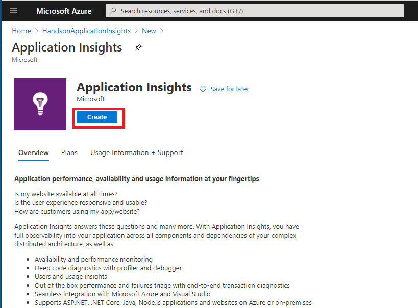

# Atividade 02

Criação do recurso do Application Insights.

## Criação da recurso do Application Insights

Documentação da Microsoft sobre a criação do recurso do Application Insights.
<https://docs.microsoft.com/pt-br/azure/azure-monitor/app/create-workspace-resource>

Logar no portal do Azure, no endereço <https://portal.azure.com/>.

Criar um Resource group chamado "HandsonApplicationInsights", para isso acessar clicar no menu superior na esquerda. Clicar na opção "Resource groups".

Clicar na opção "Add".

No campo Resource group digitar "HandsonApplicationInsights", e selecionar a região (US) East US, e clicar em "Review + create".

Confirmar a criação do Resource group clicando em "Create"

Vá até o resource group clicando na mensagem que irá aparecer após a criação do resource group.

Com o resource group aberto, clicar em "Add".

Digitar "Application Insights" no campo de pesquisa, e selecionar o item Application Insights.

Clicar em "Create".

Digitar "HandsonApplicationInsights" no campo Name, selecionar a região (US) East US no campo Region e selecionar o item "LogAnalyticsHandson" no campo Log Analytics Workspace.
A subscription terá o nome da subscription criada no quado foi realizada a criação da conta do Azure, o campo Resource Group deve ter o resource group "HandsonApplicationInsights" e a opção Resource Mode deve estar com a opção "Workspace-based" selecionada.
Clicar em "Review + create".

Clicar em "Create" para criar a instância do Application Insights.

Abra a instância criada do Application Insights.

Próxima atividade: [Atividade 03](03-atividade.md)
