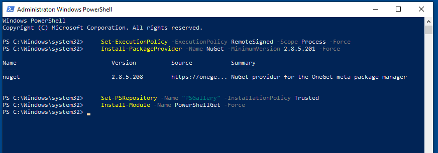
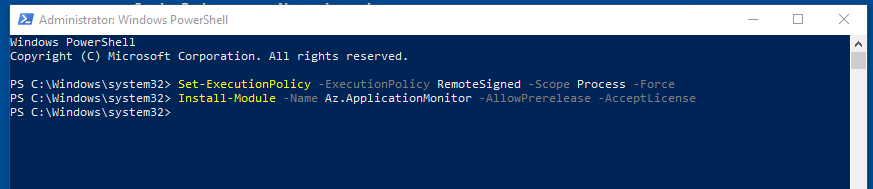
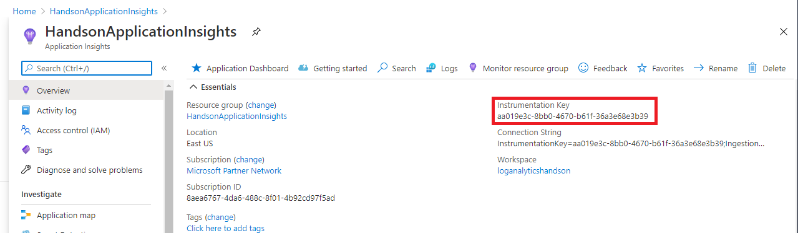
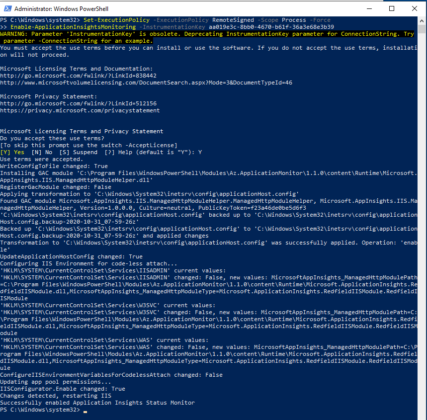

# Atividade 03

Instalação do agente do Application Insights.

## Instalação do agente do Application Insights

Documentação da Microsoft sobre agente instalado em servidores on-premises
<https://docs.microsoft.com/pt-br/azure/azure-monitor/app/status-monitor-v2-get-started>

Logar na VM criada na atividade 1.

Para instalar o agente do Application Insights, será necessário executar powershell como administrador. No box de pesquisa do Windows, digitar powershell, e clicar com o botão direito do mouse no ícone do Powershell e clicar na opção Executar como administrador.

Executar os comandos abaixo no powershell, para instalar os pré-requisitos.

    Set-ExecutionPolicy -ExecutionPolicy RemoteSigned -Scope Process -Force
    Install-PackageProvider -Name NuGet -MinimumVersion 2.8.5.201 -Force
    Set-PSRepository -Name "PSGallery" -InstallationPolicy Trusted
    Install-Module -Name PowerShellGet -Force

Executar os comandos abaixo para instalar o agente.

    Set-ExecutionPolicy -ExecutionPolicy RemoteSigned -Scope Process -Force
    Install-Module -Name Az.ApplicationMonitor -AllowPrerelease -AcceptLicense

Abrir o recurso do Application Insights criado na atividade anterior e copiar a chave de instrumentação.

Substituir a chave no comando abaixo no lugar do "xxxxxxxx-xxxx-xxxx-xxxx-xxxxxxxxxxxx".

    Set-ExecutionPolicy -ExecutionPolicy RemoteSigned -Scope Process -Force
    Enable-ApplicationInsightsMonitoring -InstrumentationKey xxxxxxxx-xxxx-xxxx-xxxx-xxxxxxxxxxxx

Reponder a pergunta "Do you accept these use terms?" com Y.

