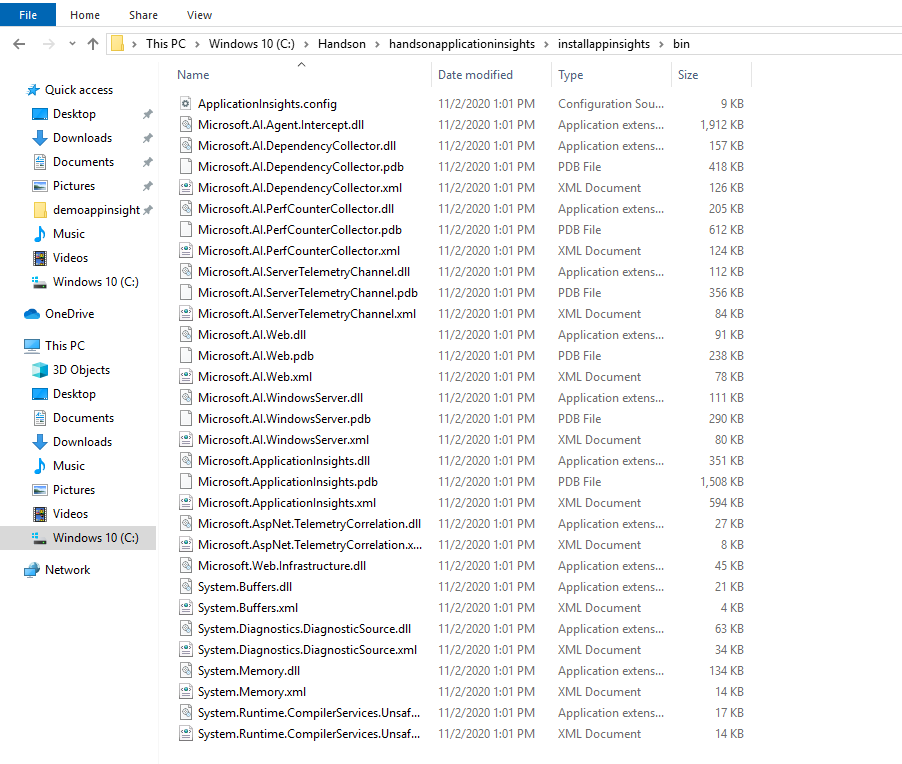
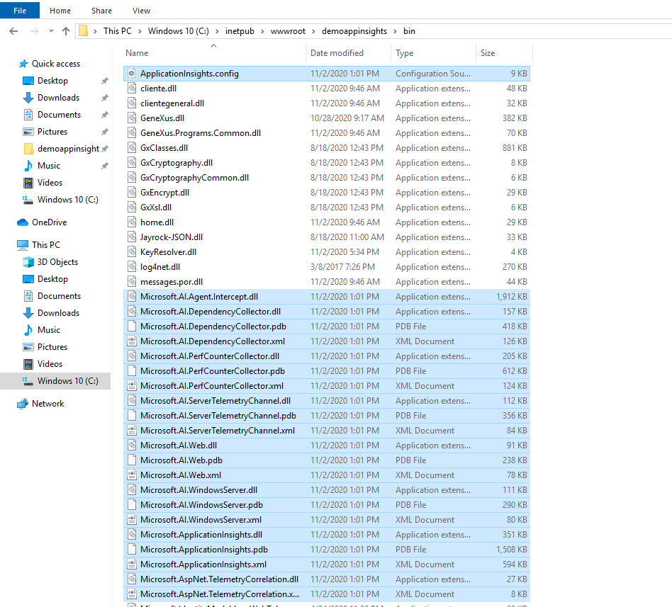
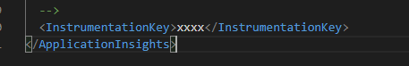
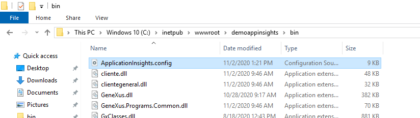
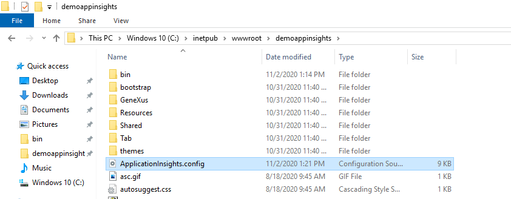
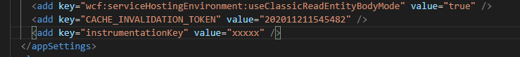
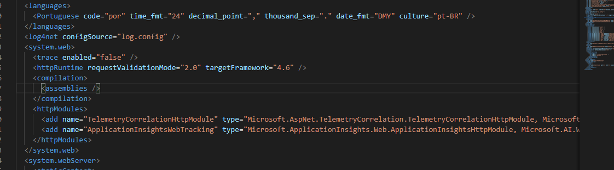
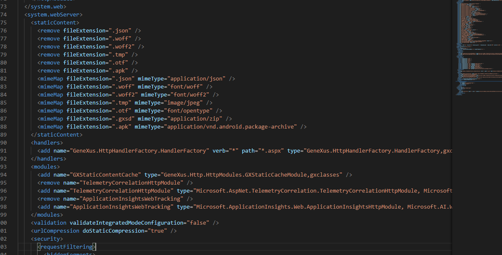
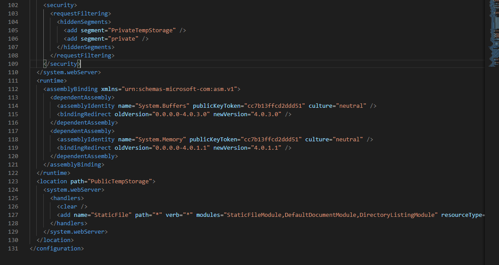
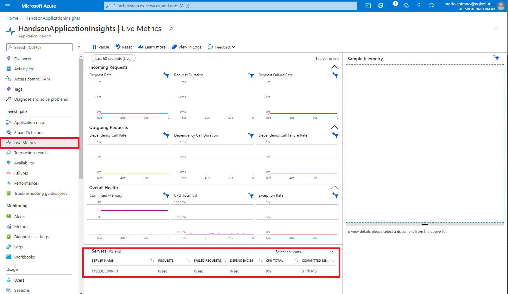

# Atividade 04

Instalação do SDK do Application Insights.

## Instalação do SDK do Application Insights

Documentação da Microsoft sobre instalação do SDK em aplicações ASP.NET
<https://docs.microsoft.com/pt-br/azure/azure-monitor/app/asp-net>

Logar na VM criada na atividade 1.

Para instalar o SDK do Application Insights, será necessário copiar as dlls do SDK  e arquivo ApplicationInsights.config para a pasta bin da aplicação.
Abrir o gerenciador de arquivos na pasta "C:\Handson\handsonapplicationinsights\installappinsights\bin".

Copiar todos os arquivos da pasta e colar na pasta bin da aplicação (C:\inetpub\wwwroot\demoappinsights\bin).

Abrir o recurso do Application Insights criado na atividade anterior e copiar a chave de instrumentação.

Abrir o arquivo ApplicationInsights.config no Visual Code, e colocar a chave de instrumentação na tag InstrumentationKey.

Copiar o arquivo ApplicationInsights.config da pasta bin (C:\inetpub\wwwroot\demoappinsights\bin) para a pasta raiz da aplicação (C:\inetpub\wwwroot\demoappinsights).

Abrir o arquivo web.config (C:\inetpub\wwwroot\demoappinsights) da aplicação no Visual Code e colocar no parâmetro "instrumentationKey" a chave de instrumentação.

Adicionar as tags abaixo na seção "system.web".

    <httpModules>
      <add name="TelemetryCorrelationHttpModule" type="Microsoft.AspNet.TelemetryCorrelation.TelemetryCorrelationHttpModule, Microsoft.AspNet.TelemetryCorrelation" />
      <add name="ApplicationInsightsWebTracking" type="Microsoft.ApplicationInsights.Web.ApplicationInsightsHttpModule, Microsoft.AI.Web" />
    </httpModules>

Adicionar as tags abaixo na seção "system.webServer".

    <remove name="TelemetryCorrelationHttpModule" />
    <add name="TelemetryCorrelationHttpModule" type="Microsoft.AspNet.TelemetryCorrelation.TelemetryCorrelationHttpModule, Microsoft.AspNet.TelemetryCorrelation" preCondition="managedHandler" />
    <remove name="ApplicationInsightsWebTracking" />
    <add name="ApplicationInsightsWebTracking" type="Microsoft.ApplicationInsights.Web.ApplicationInsightsHttpModule, Microsoft.AI.Web" preCondition="managedHandler" />

Adicionar a seção abaixo, logo abaixo da seção "system.webServer"

    <runtime>
        <assemblyBinding xmlns="urn:schemas-microsoft-com:asm.v1">
            <dependentAssembly>
                <assemblyIdentity name="System.Buffers" publicKeyToken="cc7b13ffcd2ddd51" culture="neutral" />
                <bindingRedirect oldVersion="0.0.0.0-4.0.3.0" newVersion="4.0.3.0" />
            </dependentAssembly>
            <dependentAssembly>
                <assemblyIdentity name="System.Memory" publicKeyToken="cc7b13ffcd2ddd51" culture="neutral" />
                <bindingRedirect oldVersion="0.0.0.0-4.0.1.1" newVersion="4.0.1.1" />
            </dependentAssembly>
        </assemblyBinding>
    </runtime>

Abrir o recurso do Application Insights e clicar na opção "Live Metrics", deverá ser apresentado a telemetria em tempo real da aplicação.

